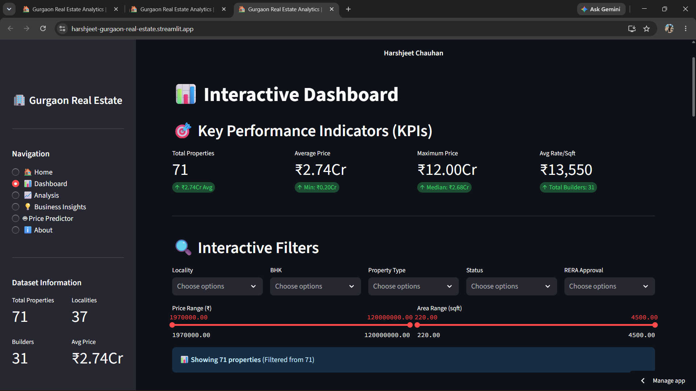
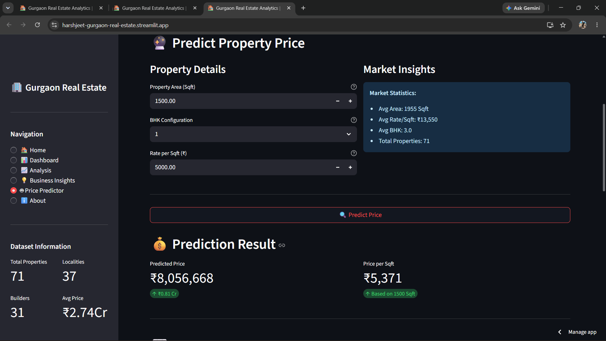

# 🏡 Gurgaon Real Estate Market Analysis

An interactive **data analytics and machine learning application** built with Python and Streamlit to explore Gurgaon's residential real estate market, identify pricing trends, generate business insights, and predict property prices.


## 🚀 Live Demo

🔗 **Explore the interactive application:**  
https://harshjeet-gurgaon-real-estate.streamlit.app/

> The live application provides interactive market analysis, business insights, data visualizations, and machine learning-based property price prediction.


## 🎯 Project Overview

This project analyzes residential property data from Gurgaon to transform raw market data into meaningful and interactive insights.

The application combines **data cleaning, exploratory data analysis, interactive visualizations, business analysis, and machine learning** in a multi-page Streamlit dashboard.

## ✨ Key Features

- 📊 **Interactive Dashboard** - Explore important property market metrics and summaries
- 📈 **Data Analysis** - Analyze pricing trends and property patterns
- 💡 **Business Insights** - Answer key real estate business questions using data
- 🤖 **Price Prediction** - Predict property prices using Linear Regression
- 🔍 **Interactive Exploration** - Explore property information through visualizations and filters
- 🏠 **Property Comparison** - View similar properties from the available market data
- 📉 **Model Performance** - View Linear Regression coefficients and R² score
- 🌐 **Multi-Page Application** - Dedicated pages for dashboard, analysis, insights, and prediction

## 🛠️ Technology Stack

### Data Analysis
- **Python**
- **Pandas**
- **NumPy**

### Data Visualization
- **Plotly**

### Machine Learning
- **Scikit-learn**
- **Linear Regression**

### Application & Deployment
- **Streamlit**
- **Streamlit Community Cloud**

### Version Control
- **Git**
- **GitHub**

## 📂 Application Pages

### 🏠 Home
Provides an overview of the project, dataset information, and application capabilities.

### 📊 Dashboard
Displays key real estate market metrics, market summaries, and property snapshots.

### 📈 Analysis
Explores property trends and patterns through interactive data visualizations.

### 💡 Business Insights
Analyzes important business questions related to property pricing, locality, builders, RERA approval, and property status.

### 🤖 Price Predictor
Uses a **Linear Regression model** with property features such as area, rate per square foot, and BHK count to estimate property prices.

The application also displays model coefficients and the R² score for model interpretation.

### ℹ️ About
Provides project details, features, technology stack, and dataset information.

## 📊 Dataset Overview

The project analyzes a Gurgaon residential real estate dataset containing:

- **71 properties**
- **37 localities**
- **31 builders**
- Property area information
- BHK configurations
- Property prices
- Rate per square foot
- Property status
- Builder information
- RERA-related information

## 🤖 Machine Learning Model

The Price Predictor uses **Linear Regression** from Scikit-learn.

### Model Features

- Area
- Rate per Square Foot
- BHK Count

### Target Variable

- Property Price

The model is trained using the available cleaned property dataset and is used to estimate property prices based on selected property features.

## 🚀 Run the Project Locally

## 🚀 Run the Project Locally

Clone the repository:

```bash
git clone https://github.com/Harsh827385/Gurgaon-Real-Estate-Analysis.git
```

## 📸 Project Screenshots

### 🏠 Home Page


### 📊 Interactive Dashboard



### 🤖 Property Price Predictor

